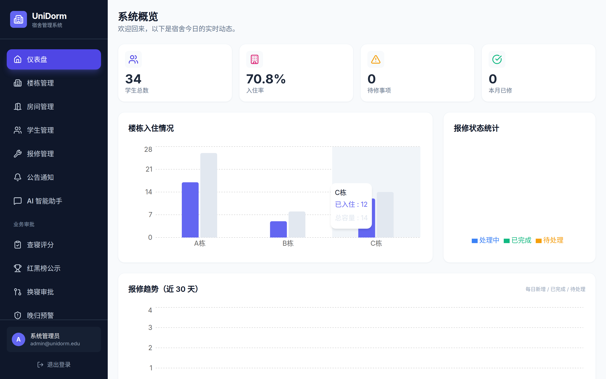
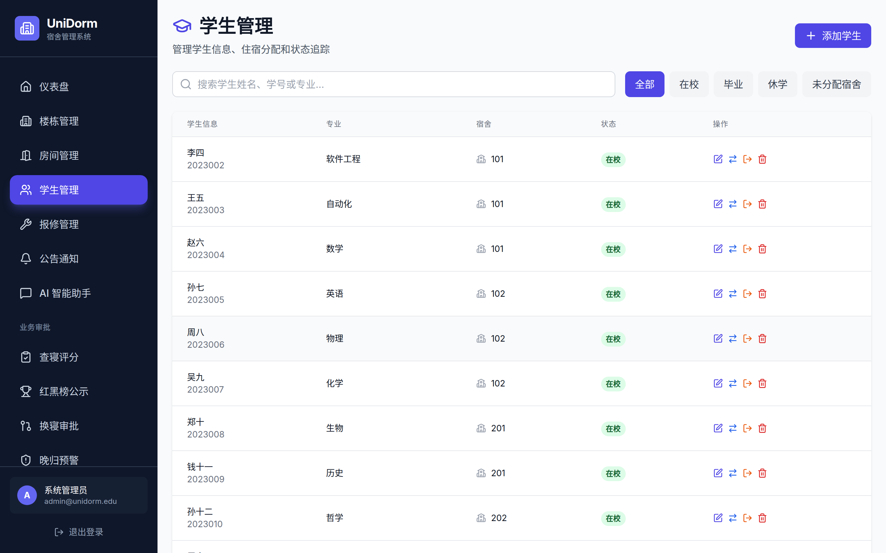
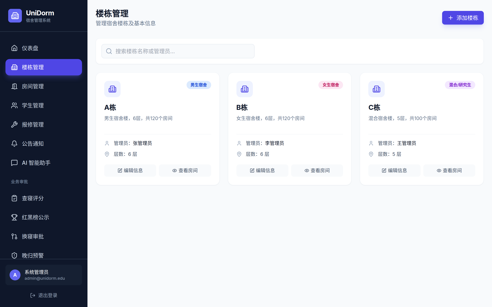
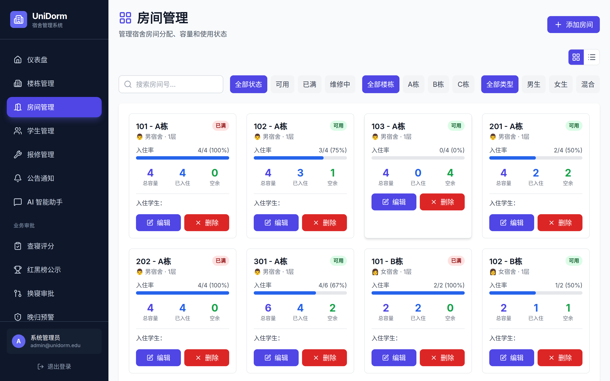
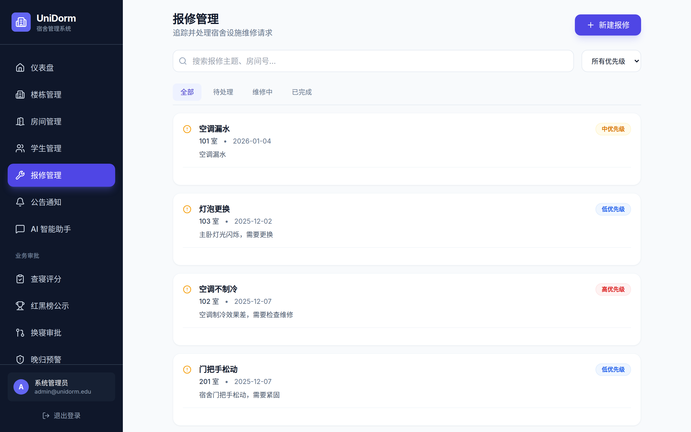
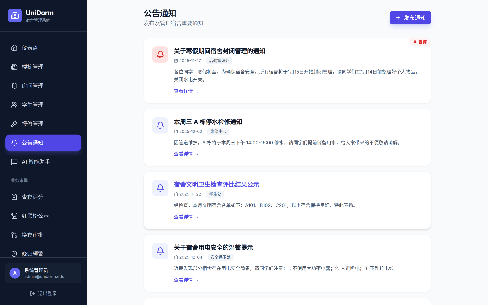
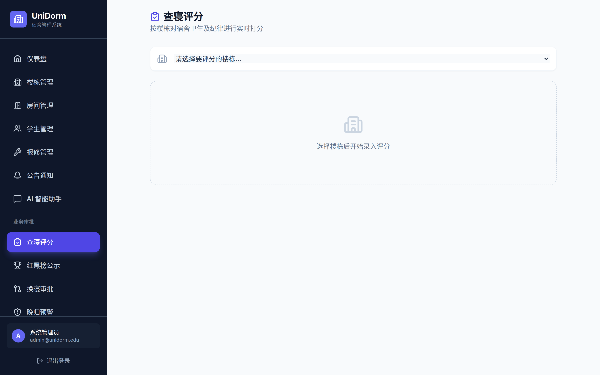
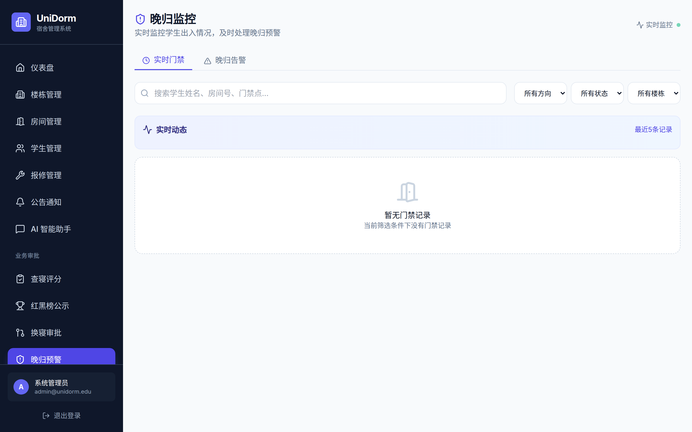
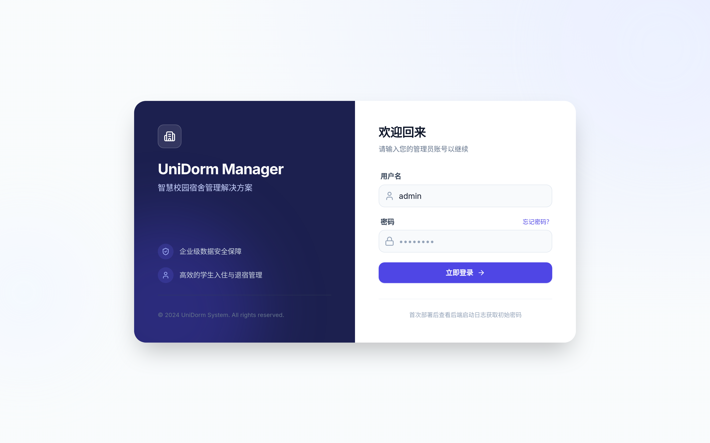

<h1 align="center">UniDormManager</h1>

<p align="center">
  开箱即用的宿舍管理系统 — Go 后端 + React 19 前端 + PostgreSQL,带 RBAC、审计、SSE 实时流和 Prometheus 指标。
</p>

<p align="center">
  <a href="https://github.com/DevMinions/UniDormManager/actions/workflows/ci-cd.yml"></a>
  <a href="https://github.com/DevMinions/UniDormManager/releases/latest"></a>
  <a href="LICENSE"></a>
  <a href="https://golang.org/"></a>
  <a href="https://react.dev/"></a>
  <a href="https://render.com/deploy?repo=https://github.com/DevMinions/UniDormManager"></a>
</p>

<p align="center">
  <a href="README.md">简体中文</a> · <a href="README.en.md">English</a> · <a href="docs/ARCHITECTURE.md">架构</a> · <a href="docs/API.md">API</a>
</p>

<p align="center">
  
</p>

<details>
<summary>更多截图(学生 / 楼栋 / 房间 / 报修 / 公告 / 查寝 / 门禁 / 登录)</summary>

|  |  |
|---|---|
| 学生管理 | 楼栋管理 |
|  |  |
| 房间管理 | 报修工单 |
|  |  |
| 公告 | 查寝 |
|  |  |
| 门禁与晚归告警 | 登录 |

截图由 `scripts/capture_screenshots.js` 自动抓取,发版重跑即可同步。

</details>

## Features

- **业务覆盖完整** — 学生 / 楼栋 / 房间 / 报修 / 公告 / 查寝 / 门禁 / 晚归 / 换寝,8 个一线管理域全部带 UI
- **RBAC + JWT** — 角色与权限矩阵存数据库,system-admin 通配,新增路由自动包含
- **审计与 SSE 实时流** — 所有写操作记录 `audit_logs`,Dashboard 通过 `/api/audit-logs/stream` 实时显示最近 10 条
- **可观测性** — `/metrics` 暴露 Prometheus 指标,自带 Grafana dashboard 11 个 panel 覆盖业务 / HTTP / 审计 / Scheduler
- **一键部署** — Docker Compose 本地全栈 / Render Blueprint 云端一键(PostgreSQL + 后端 + 前端)
- **端到端基线 105 项** — `make audit` 跑全部 E2E harness(audit_api + 4 个 UI CRUD + workflow),CI 期间一键回归

## Tech Stack

| 层 | 选型 |
|---|---|
| 后端 | Go 1.23 · Gin · pgx · golang-jwt · robfig/cron · prometheus client |
| 前端 | React 19 · TypeScript · Vite · Tailwind · Recharts · HashRouter |
| 数据 | PostgreSQL 16 · Redis 7(可选缓存) |
| 监控 | Prometheus · Grafana(provisioning 已配) |
| 测试 | Vitest · `go test` · Playwright(audit_web 系列) |
| 部署 | Docker Compose · Render Blueprint · GitHub Actions |

## Quick Start

需要 Docker 20.10+ 与 Docker Compose 2.0+。

```bash
git clone https://github.com/DevMinions/UniDormManager.git
cd UniDormManager
make up
```

服务启动后:
- 前端:http://localhost:3000
- 后端:http://localhost:8080
- Grafana:http://localhost:3001

首次启动后,**后端日志会打印一次** `INITIAL PASSWORD: <16 字符>`(或通过 `ADMIN_INITIAL_PASSWORD` 环境变量预设)。账号 `admin`,首次登录后请立即改密码。

可选导入测试数据:

```bash
docker compose exec -T postgres psql -U postgres -d unidorm < scripts/seed_test_data.sql
```

### 一键云端部署

点击顶部 **Deploy to Render** 按钮,Render 会按 `render.yaml` 拉起 PostgreSQL + 后端 + 前端。部署完成后:

1. 在 Render dashboard 找到 `unidorm-backend` 服务真实域名
2. 编辑 `unidorm-web` 的 `VITE_API_URL` 改为 `https://<backend域名>.onrender.com/api`
3. 触发 `unidorm-web` 重新构建
4. 从 `unidorm-backend` 启动日志取 `INITIAL PASSWORD` 登录

Render Free 计划 idle 15min 后 sleep,首访冷启 ~30s;PostgreSQL 90 天免费试用。生产请用付费 plan 或 `make up` 自托管。

## Documentation

- [架构总览](docs/ARCHITECTURE.md) — C4 容器图 + 后端分层 + 关键流程 Mermaid
- [API 参考](docs/API.md) — 所有端点 + 请求 / 响应示例
- [部署指南](docs/DEPLOYMENT.md) · [Docker 部署](docs/DOCKER.md) · [数据库初始化](docs/DATABASE_INIT.md)
- [开发规范](docs/DEVELOPMENT_GUIDE.md) · [用户手册](docs/USER_MANUAL.md) · [角色权限](docs/ROLE_BASED_DESIGN.md)
- [变更日志](docs/CHANGELOG.md) · [安全策略](SECURITY.md) · [贡献指南](CONTRIBUTING.md)

## Development

不走 Docker 起本地开发服务:

```bash
# 后端(需先起 PostgreSQL)
cd UniDormManagerServer
go mod download
go run main.go

# 前端
cd UniDormManagerWeb
npm install
npm run dev
```

详细环境变量见 [DEPLOYMENT.md](docs/DEPLOYMENT.md)。

## Testing

```bash
make test       # 后端 go test + 前端 vitest
make audit      # 全 E2E baseline 105 项(audit_api + 4 个 UI CRUD + workflow)
```

`make audit` 需要 vite preview :3000、后端 :8082、admin/admin123 都到位,任一 harness fail 立即停后续。详见 [Makefile](Makefile)。

## Project Structure

```
UniDormManager/
├── UniDormManagerServer/    Go 后端(handlers / store / middleware / scheduler / audit / monitoring)
├── UniDormManagerWeb/       React 19 前端(pages / hooks / services / contexts)
├── tests/                   E2E harness(audit_api.py / audit_web*.js)
├── scripts/                 SQL 迁移 / 一次性修复脚本
├── docs/                    长文档(ARCHITECTURE / API / DEPLOYMENT 等)
├── grafana/                 Grafana provisioning(datasources + dashboards)
├── render.yaml              Render Blueprint(一键云部署)
├── docker-compose.yml       本地全栈编排
└── Makefile                 常用命令入口
```

## Contributing

欢迎提 Issue / PR。请先读 [CONTRIBUTING.md](CONTRIBUTING.md) 了解分支策略、commit message 规范和本地测试要求。安全相关问题请走 [GitHub Private Vulnerability Reporting](SECURITY.md),不要直接提 Issue。

## License

[MIT](LICENSE) © DevMinions
