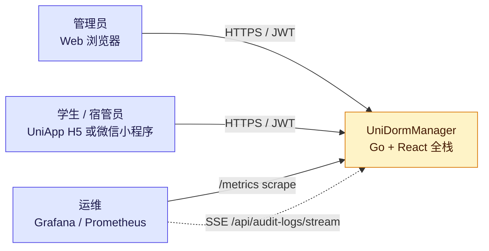
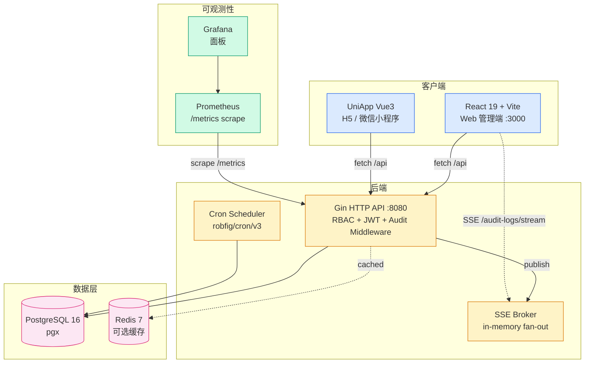
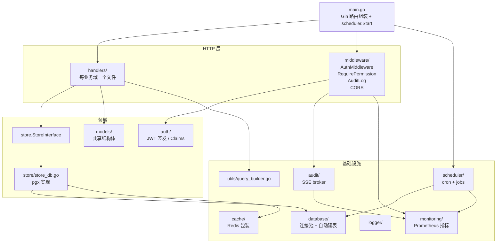
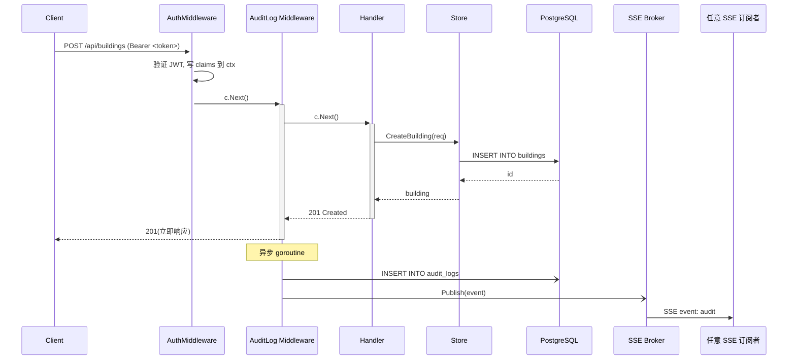
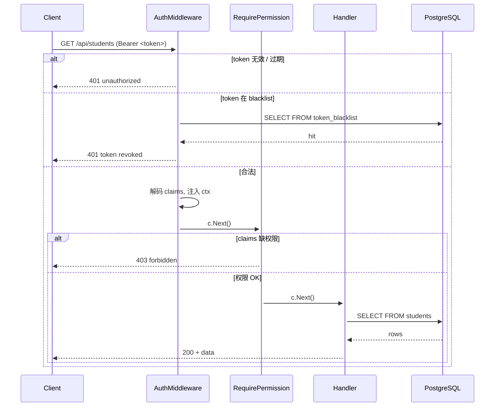
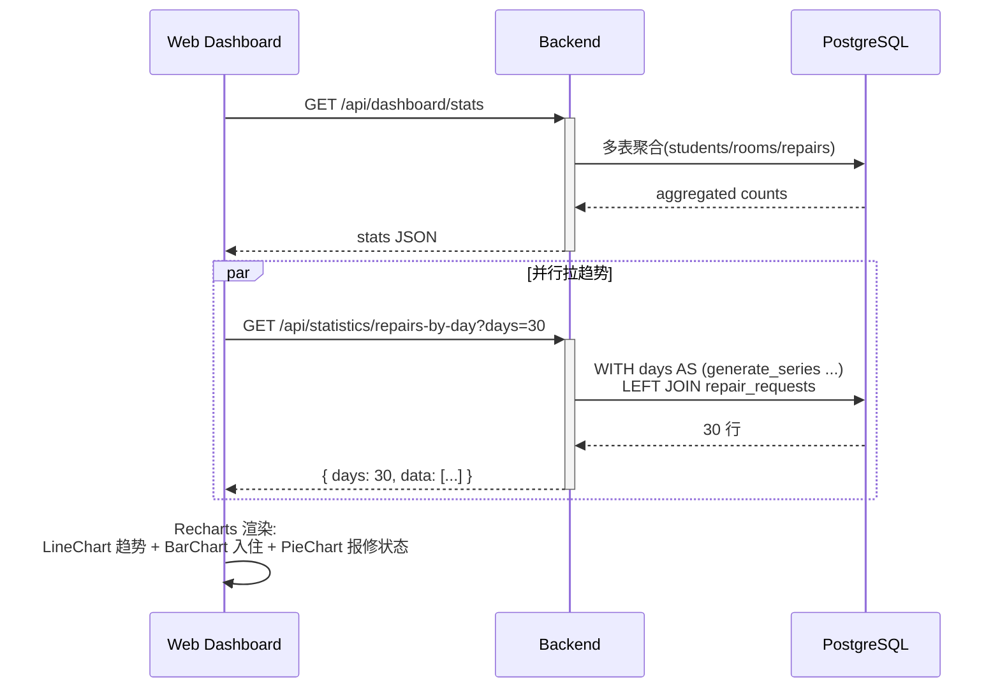
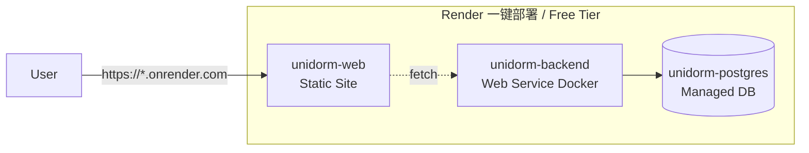

# Architecture

> UniDormManager 的整体结构与关键流转。Mermaid 图,GitHub 与多数 Markdown 阅读器原生渲染。

## 系统上下文(C4 L1 — Context)

外部接入只有三类:Web 浏览器(本仓库)、UniApp 客户端(独立 [Mobile repo](https://github.com/DevMinions/UniDormManager-Mobile))、运维监控。

---

## 容器视图(C4 L2 — Container)

**关键事实**:
- 单 Go 进程内集成 HTTP API + cron + SSE broker(无独立 worker / 消息队列)。
- Redis 是可选缓存(`USE_CACHE=true` 才启用),不存关键状态。
- SSE broker 是 in-memory fan-out;事件持久化由 `audit_logs` 表保证。

---

## 后端包分层(C4 L3 — Component)

依赖方向(箭头)始终 outside-in,**没有循环**:
- HTTP 层依赖 Domain;Domain 依赖 Infra;Infra 不反向依赖。
- `monitoring` 是叶子节点,被所有人调用。
- `store` 用接口(`StoreInterface`)抽象,handler 测试时可用 mock 替代。

---

## 关键流程:写请求 + 审计

要点:
- **AuditLog 在 `c.Next()` 后才落库**——这样它能拿到最终 status code,只记 `< 400` 的成功操作。
- **DB 写 + broker publish 都在 goroutine**,client 已经拿到 201,不会被审计 IO 阻塞。
- **goroutine 失败仅 log**——审计可丢,业务不丢。

---

## 关键流程:JWT 鉴权 + RBAC

权限模型详见 [RBAC design](ROLE_BASED_DESIGN.md)。

---

## 数据流:Dashboard 时序图渲染

时序图 SQL 用 `generate_series` 补缺日,前端拿到的永远是连续 N 个数据点。

---

## 部署拓扑

或本地 `make up` 走 docker-compose 全栈(含 Redis + Grafana,详见 [Docker 部署指南](DOCKER.md))。

---

## 相关文档

- [API 接口文档](API.md) — 含 v0.2.0 新增接口
- [部署](DEPLOYMENT.md)
- [开发规范](DEVELOPMENT_GUIDE.md)
- [角色权限设计](ROLE_BASED_DESIGN.md)
